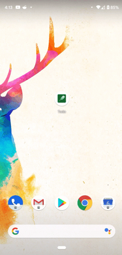

# *:warning: Warning: Go to [App Actions Dyanamic Shortcut sample](https://github.com/android/app-actions/dynamic-shortcuts) for maintained sample.

*:warning: Warning: This [App Actions Dyanamic Shortcut sample](https://github.com/android/app-actions/dynamic-shortcuts) has migrated to [App-Action directory](https://github.com/android/app-actions) in Andriod Github. This version will no longer be maintained.*

This sample Android app manages items on to-do lists. Users can add items to to-do lists, search for items by category, and view information about completed tasks.

Note: This sample application is a fork of the [Android to-do sample](https://github.com/android/architecture-samples).

By implementing [App Actions](https://developers.google.com/assistant/app/), the app can additionally respond to user queries (voice or text) with the help of Google Assistant.

App Actions uses [Android Shortcuts](https://developer.android.com/guide/topics/ui/shortcuts) in order to launch an app in response to the query. This app demonstrates how to implement dynamic shortcuts in an app to allow the user to launch the app directly into an in-app item requested by the user.

<div style="text-align:center">
  
</div>

## Requirements

For security and verification reasons, the account you use to upload your `shortcuts.xml` file with the App Actions test tool must have ownership of the application ID.

Additionally, you must meet the setup and usage requirements for [App Actions](https://developers.google.com/assistant/app/get-started#requirements) and for the [App Actions test tool](https://developers.google.com/assistant/app/test-tool#setup_requirements).

## How to use this sample

Clone or download the project to your preferred location. Then, import and modify the project with the following steps:

1. In Android Studio, select **Open an existing Android Studio project** from the initial screen, or go to
   **File > Open**.
2. Change the `applicationId` in [app/build.gradle](app/build.gradle) to the `applicationId` of one of your draft or published apps in the Google Play Console.

    ```groovy
    android {
        defaultConfig {
            // This ID uniquely identifies your app on the device and in Google Play
            applicationId "com.example.myapp"
        }
    }
    ```

3. Change the two (2) `android:targetPackage` in [app/src/main/res/xml/shortcuts.xml](app/src/main/res/xml/shortcuts.xml) to the `applicationId` in your [app/build.gradle](app/build.gradle).

    ```xml
    <capability android:name="actions.intent.GET_THING">
        <intent
            android:targetPackage="PUT_YOUR_APPLICATION_ID_HERE"
            >
        </intent>
    </capability>
    ```
   
    ```xml
    <capability android:name="actions.intent.GET_THING">
        <intent
            android:targetPackage="PUT_YOUR_APPLICATION_ID_HERE"
            >
        </intent>
    </capability>
    ```

4. In Android Studio, find the root directory of the sample.
5. Select the `build.gradle` file.
6. Follow the instructions presented by the IDE.

Then, you can try the App Actions by following these steps:

1. Build and run the sample on your physical test device (**Run "app"**).
2. Open the app and create a to-do item.
3. Open the Shortcuts test tool (**Tools > Google Assistant > Shortcuts Test Tool**).
4. Select the shortcut corresponding to the to-do item, and press "Test". You should see an app opened
for that to-do item.

<div style="text-align:center">
  
</div>

If you run into any issues, check out the [troubleshooting guide](https://developers.google.com/assistant/app/troubleshoot) in our developer documentation.

## Contribution guidelines

If you want to contribute to this project, be sure to review the
[contribution guidelines](CONTRIBUTING.md).

We use [GitHub issues](https://github.com/actions-on-google/appactions-common-biis-kotlin/issues) for
tracking requests and bugs, please get support by posting your technical questions to
[Stack Overflow](https://stackoverflow.com/questions/tagged/app-actions).

Report [general issues with App Actions features](https://issuetracker.google.com/issues/new?component=617864&template=1257475)
or [make suggestions for additional built-in intents](https://issuetracker.google.com/issues/new?component=617864&template=1261453)
through our public issue tracker.

## References

* [App Actions Overview](https://developers.google.com/assistant/app/overview)
* [Built-in Intents reference](https://developers.google.com/assistant/app/reference/built-in-intents/bii-index)
* [App Actions Test Tool](https://developers.google.com/assistant/app/test-tool)
* [Codelab](https://developers.google.com/assistant/app/codelabs)
* [Other samples](https://developers.google.com/assistant/app/samples)
